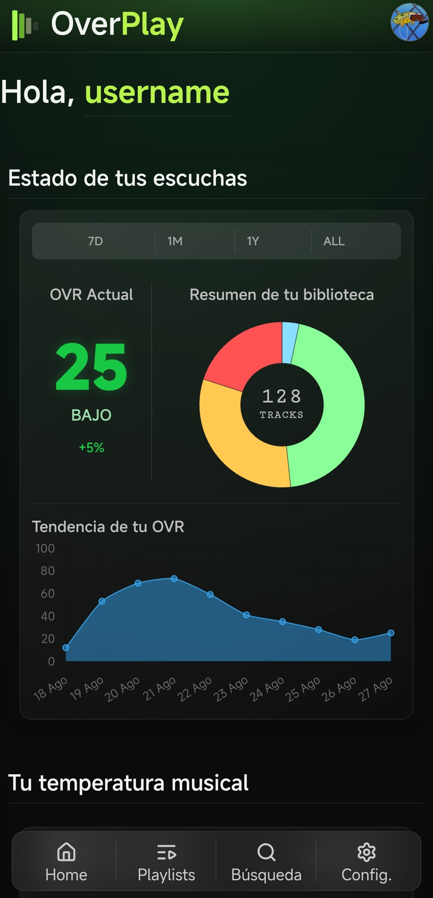

# OverPlay

OverPlay is a personal project for analyzing Spotify listening history and detecting patterns related to musical fatigue and repetition.

The project started as a way to experiment with my own Spotify listening data and has gradually grown into a full-stack application.



> 🚧 **Currently being refactored**
>
> I'm currently restructuring the frontend and improving the project architecture.

## What does it do?

OverPlay processes Spotify listening history to generate statistics and indicators about listening habits.

Some of the current features include:

- Spotify authentication
- Listening history analysis
- Musical fatigue / repetition analysis
- User statistics and charts
- Multi-user support
- Personal dashboard

## Tech stack
- PWA
- ngrok

### Frontend
- HTML
- CSS
- JavaScript
- Chart.js

### Backend
- Python
- FastAPI
- SQLite

### Other
- Spotify Web API
- Git / GitHub

## Project structure

The project is currently being reorganized, so the structure is still changing.

```text
OverPlay/
├── README.md
├── CHANGELOG.md
├── Backend/ (future refactor)
├── app/ (Refactoring)
       ├──index.html
       ├── css/
       ├── data/
       └── js/
└── ...
